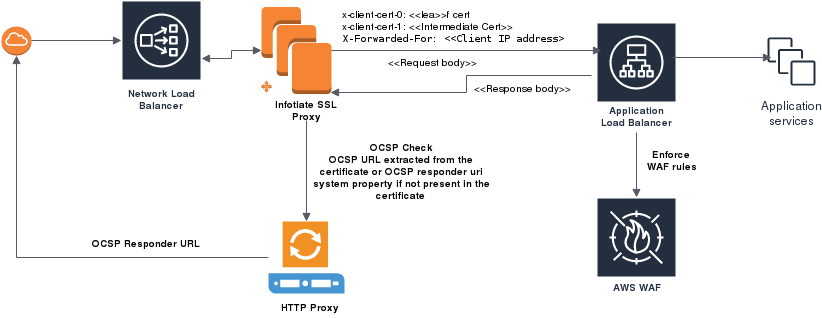

# Using Zuul as SSL Proxy with OCSP
We created this simple spring boot application using Zuul proxy to utilize native Java 9 support for [OCSP stapling](https://en.wikipedia.org/wiki/OCSP_stapling) and [OCSP](https://en.wikipedia.org/wiki/Online_Certificate_Status_Protocol) check during certificate path validation. The application support following features

 - Reverse proxy with TLS MA support
 - OCSP stapling
 - Extract certificate chain from the SSL session including intermediate CAs and forward it to the load balancer such as AWS ELB
 - Perform OCSP check on the client certificate chain with an option to validate only the leaf certificate
 
 **Why we created this application?** 
 
During our testing we have faced several challenges with commercial grade firewalls having limitations such as 
 
 - Ability to pass certificate chain including intermediate CAs to downstream system for example AWS ALBs does not provide this capability. 
 - Many of the open source systems such as HAPROXY and NGINX does provide but only the leaf certificate is passed. Code can be extended however it will be very difficult to maintain the large code base that these systems have
 
 **Deployment model on AWS**
 
 
