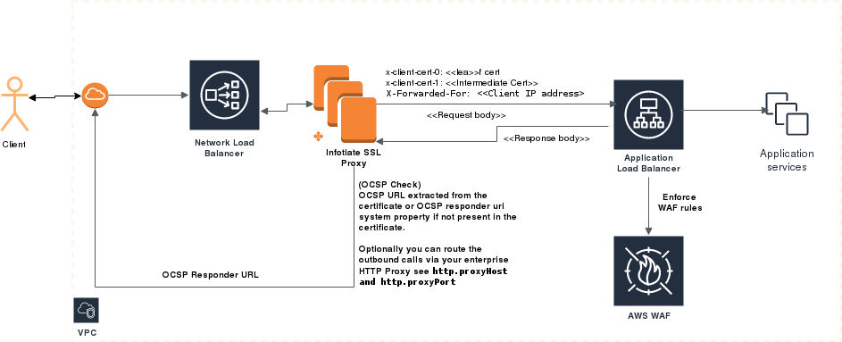

# Using Zuul as SSL Proxy with OCSP
We created this simple spring boot application using Zuul proxy to utilize native Java 9 support for [OCSP stapling](https://en.wikipedia.org/wiki/OCSP_stapling) and [OCSP](https://en.wikipedia.org/wiki/Online_Certificate_Status_Protocol) check during certificate path validation. The application support following features

 - Reverse proxy with TLS MA support
 - Option to support OCSP stapling when requested by HTTP client during SSL handshake
 - Extract certificate chain from the SSL session including intermediate CAs and forward it to the load balancer such as AWS ALB
 - Perform OCSP check on the client certificate chain with an option to validate only the leaf certificate
 
 **Why we created this application?** 
 
During our testing we have faced several challenges with commercial grade and open source reverse proxy servers however there are several limitations we encounter during our evaluation with these products which are needed to address our use cases such as : 
 
 - We need the ability to pass entire certificate chain retrieved from SSL handshake to our application to establish client trust. Many of the open source systems such as HAPROXY and NGINX can extract the client certificates however only the leaf certificate is passed. We could have extended their code however it will be very difficult to maintain the large code base that these systems have
 - We wanted to check the validity of the certificates in the certificate chain using OCSP responder url present inside the certificate.  [OCSP support added in Java starting from Java 9 on wards](https://docs.oracle.com/en/java/javase/12/security/java-pki-programmers-guide.html#GUID-E6E737DB-4000-4005-969E-BCD0238B1566) however we needed more control over the certificate path validation process
 
 **Deployment model on AWS**
 
 
